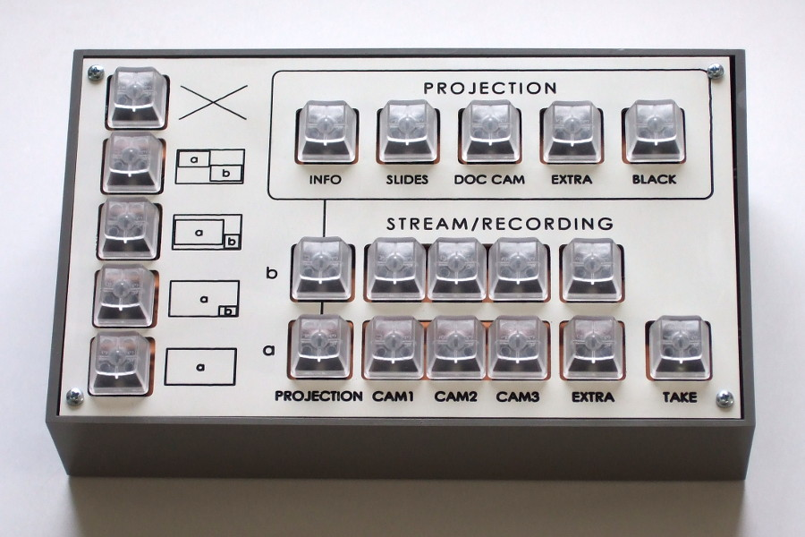
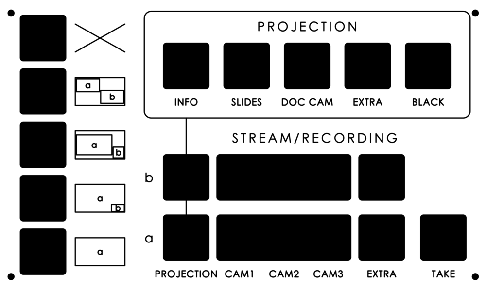

Voctoknopf
==========

Voctoknopf is a physical device built for the video mixing operators
at Chaos Communication Congress and maybe other conferences.

There are several design goals which drive the development of
Voctoknopf, most of which are intended to solve the problems which
came up with the switch to software video mixers:

* Provide the operator with **physical buttons** to press.

  There's a huge difference between having actual buttons which light
  up in response to the current state of the mixer and having commands
  in a software GUI bound to keyboard shortcuts.

* **Map the technical situation** in the hall **as accurately as
  possible** to the user interface.

  Currently, much implicit knowledge about the setup is required in
  order to operate the mixer effectively.  The user interface is
  designed for re-usability, not to the operator's needs.  Voctoknopf
  reverses this by putting as much knowledge about the setup as
  possible into the user interface, increasing the one-time effort of
  adapting the device in order to make things easier for each
  operator.

* Allow the operator to pre-select a channel and then apply the
  selection with a **“TAKE” button**.

  This re-creates the basic usage pattern of hardware video mixers
  which has proven useful in the past.

* **Bundle the controls** in one place.

  The controls at the operator's desk are currently scattered over too
  many devices: the computer running the mixer GUI, the hardware video
  mixer controlling the projection, and an external intercom.
  Voctoknopf should be able to control all these functions so there's
  no need to juggle between different devices.

The situation where a well-designed user interface is most important
is for talks which are stressful to record, not those which pose
little difficulty to the operator anyway.  Therefore, Voctoknopf is
designed with the assumption that the operator is performing at the
fringe of their capacity, and that the interface should be usable as
intuitively and get into the operator's way as little as possible.

Challenges
----------

**Communication with the Voctomix software:** The existing setup
comprises an encoder computer running `voctocore` and a laptop
computer running `voctogui` which [communicates to the encoder via
TCP](Protocol.md).  The two obvious approaches are to design the
hardware as a peripheral to `voctogui` or to have the hardware talk
directly to `voctocore` via TCP.

**Buttons:** The buttons should be sufficiently large (at least
15x15mm) and able to be lit in two different ways—or at least two
different colors—for indicating the preselected and live output.  Good
buttons matching these criteria are surprisingly expensive, especially
in larger quantities; the least expensive ones appear to be E-Switch
LP6OA2ASRG at about 5€, which would more than double the budget of the
project.  Therefore, Voctoknopf uses Cherry MX switches (about 0.50€)
with translucent keycaps.

General features
----------------

This repository contains the hardware and software of the Voctoknopf
version developed by Roland Lutz, as well as general code and
information useful to the project.  The key features of this version
of Voctoknopf are:

* Cherry MX Silent Black keys with standard clear keycaps (row 3)
* CNC-milled aluminum frontplate
* TEKO 363 enclosure
* driven by an Olimex RT5350F-OLinuXino
* communicates with the Voctomix software via TCP

It has the following controls:

* 5 buttons with blue LEDs controlling the projection hardware mixer
* 5 buttons with red/green LEDs selecting the overall status of the
  output signal: single source, composition mode, or off
* 5 buttons with red/green LEDs selecting the source for channel A
  (big/left picture)
* 5 buttons with red/green LEDs selecting the source for channel B
  (small/right picture)
* a “TAKE” button

Rear connections ([picture](prototype-rear.jpg)):

* +5V DC connector (5.5mm outside diameter, 2.1mm pin diameter, pin = +)
* Ethernet connector
* red power LED
* yellow link LED
* green general-purpose LED

The DC connector and the LEDs are connected to the PCB via 2-pin JAE
connectors.  For the Ethernet connector, a socket connected to an
extension cord is mounted to the enclosure wall.

**Make sure not to connect anything but +5V DC to the hardware.**
There is a labelled AC adapter for each device; if possible, don't
use any other power source.

Button layout
-------------

The user interface is designed to represent the technical setup as
closely as possible: the various inputs which can be projected in the
hall are controlled by a hardware mixer, the result of which is
available as a source for the software mixer.  There is no distinction
between stream and recording as both use the same output signal.

All buttons except those for controlling the projection use a two-step
mechanism: the operator first selects an output image by pressing the
appropriate buttons.  Then, they apply this selection by pressing
“TAKE”.  The formerly active image becomes the new selection, so they
can switch between these two images by repeatedly pressing “TAKE”.

The color of the illumination represents the color of the tallies: the
buttons corresponding to the current output light up red, and the
buttons which are selected light up green.  Buttons which are both
active and selected light up both red and green, resulting in an amber
color.

There are five states for the output signal to select from:

* **Off**: No signal is streamed; the stream shows the words “PAUSE”
   or “NO STREAM”.

* **Side-by-side equal**: Both rows of source buttons are active.
  Source A and source B are reduced to slightly lower than half their
  size and shown side-by-side.

* **Side-by-side preview**: Both rows of source buttons are active.
  Source A is shrunk and shown on the left; source B is both cropped
  and shrunk and shown on the right.

* **Picture in picture**: Both rows of source buttons are active.
  Source A is shown full-screen with source B overlaid in the bottom
  right corner.

* **Single source**: Only the row of buttons for source A is active.
  The selected source is shown full-screen.

Both the selection rows for projection and output contain a button for
an extra signal.  This is to cover special cases where there are
additional projected or non-projected sources, e.g. a handheld camera.

This version does not contain a push-to-talk button or intercom
functionality since for the 34C3, a commercial intercom system has
been used.

Variants
--------

There are two variants of this Voctoknopf which only differ in the
front plate and the number of switches populated:

* The 3-camera variant for Hall Adams, Hall Borg, and training is
  fully populated.  It can select between the projection, three
  cameras, and an extra source.

* The 2-camera variant for Hall Clarke and Hall Dijkstra contains all
  buttons except those for camera 3.  It can select between the
  projection, two cameras, and an extra source.

References
----------

* [VOC wiki documentation](https://c3voc.de/wiki/)
* [Voctomix repository](https://github.com/voc/voctomix)
* [Voctomix configuration repository](https://github.com/voc/cm)
* [Other versions of Voctoknopf](https://c3voc.de/wiki/voctomix:voctopanel)
